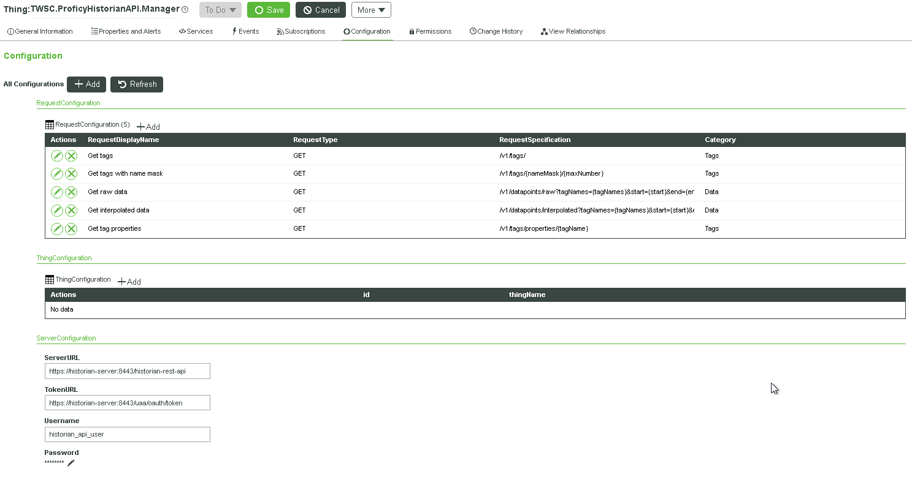
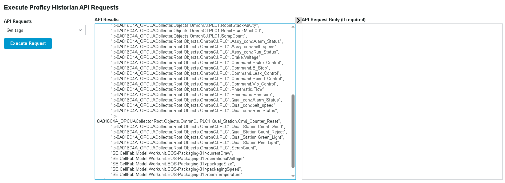
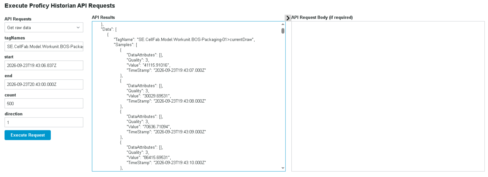
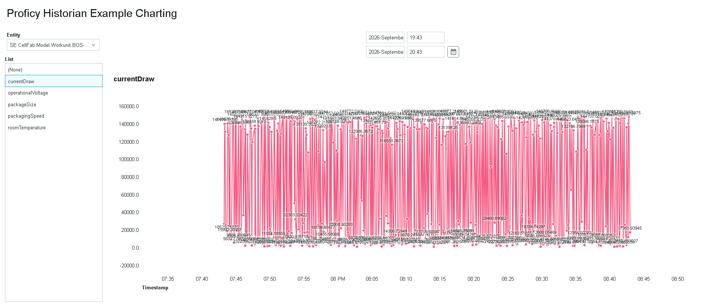

# Proficy Historian API Building Block

## Overview
The Proficy Historian API Building Block provides a configurable integration layer between ThingWorx and the Proficy Historian REST API. The Building Block handles OAuth authentication, request execution, parameterized API calls, tag discovery, and historical data retrieval.

The goal of this Building Block is to provide a quick start for accessing Historian data from ThingWorx applications without requiring custom REST logic in every solution.

The Building Block includes:
- Configurable REST API request definitions
- OAuth token management and caching
- Historian tag discovery services
- Historical data query services
- Example mashups demonstrating API execution and charting
- Configuration for adding additional Historian REST API requests

Also refer to the [included presentation](<docs/ThingWorx Proficy Historian API BB.pdf>) for a brief overview. 

## Prerequisites
Before importing this Building Block, the following components must already be installed and configured:
- ThingWorx Foundation 9.7 (or above)
- ThingWorx Solutions Common (PTC.Base Building Block)
- Proficy Historian
    - REST API enabled
    - OAuth authentication enabled
    - A service account with API read permissions
    - Historian tags available through the REST API

## Historian Tag Naming Convention
This proof of concept assumes Historian tags follow the naming pattern:

```text
<EntityName>><PropertyName>
```

Examples:

```text
SE.CellFab.Model.Workunit.BOS-Packaging-01>currentDraw
SE.CellFab.Model.Workunit.BOS-Packaging-01>operationalVoltage
SE.CellFab.Model.Workunit.BOS-Packaging-01>packagingSpeed
```

The example services use the `>` character to separate an entity from its associated property.

This convention allows the Building Block to:

- Discover available entities
- Enumerate properties for an entity
- Generate chart-friendly tag lists
- Query multiple related Historian tags

If a different tagging convention is used, the example services will need to be modified.

## Installation
1. Import the Building Block extension package into ThingWorx.
2. Locate the TWSC.ProficyHistorianAPI.Manager Thing.
3. Configure the Server Configuration settings (see next section).
4. Test connectivity by executing the GetOAuthToken service.

## Configuration
Open the Historian API Manager Thing (TWSC.ProficyHistorianAPI.Manager) in ThingWorx Composer 
and navigate to the **Configuration** tab.



### Server Configuration
Populate the following values:

| Setting | Description |
|----------|-------------|
| ServerURL | Base URL of the Historian REST API |
| TokenURL | OAuth token endpoint |
| Username | Historian API username |
| Password | Historian API password |

Example:

```text
ServerURL:
https://historian-server:8443/historian-rest-api

TokenURL:
https://historian-server:8443/uaa/oauth/token

Username:
historian_api_user

Password:
********
```

### Request Configuration
The Building Block stores available API requests in the `RequestConfiguration` table.

Each entry contains:

| Field | Description |
|-------|-------------|
| RequestDisplayName | User-friendly request name |
| RequestType | GET, POST, PUT |
| RequestSpecification | Relative API path |
| Category | Request grouping |

Example:

| RequestDisplayName | RequestType | RequestSpecification | Category |
|--------------------|-------------|----------------------|----------|
| Get tags | GET | `/v1/tags` | Tags |

Example with parameters:

| RequestDisplayName | RequestType | RequestSpecification | Category |
|--------------------|-------------|----------------------|----------|
| Get raw data | GET | `/v1/datapoints/raw?tagNames={tagNames}&start={start}&end={end}&count={count}` | Data |

Parameters enclosed in braces are replaced at runtime. The Building Block supports up to 6 parameters.

## Included Sample Requests
The proof of concept includes several preconfigured Historian requests:

### Tag Operations
- Get tags
- Get tags with name mask
- Get tag properties

### Data Operations
- Get raw data
- Get interpolated data

Additional Historian API endpoints can be added by inserting rows into the Request Configuration table.

## Core Services
### ExecuteRequest
Executes a configured Historian REST API request by resolving configured request templates, 
substituting runtime parameters, obtaining an OAuth access token, and returning the resulting
JSON response from the Historian server. This service serves as the primary integration point
for other services and Building Blocks that need direct access to Historian REST API data.

Features:
- Parameter substitution using configurable request templates
- GET, POST, and PUT support
- JSON response handling
- Automatic request authentication via OAuth access tokens

### GetOAuthTOken
The GetOAuthToken service authenticates with the configured Proficy Historian OAuth endpoint, caches the returned
access token, and automatically refreshes it when necessary to support authenticated API requests.

### GetParametersFromRequest
Extracts parameter placeholders from a configured request specification and returns the parameters required to execute the request.
 
### GetRequestSpecification
Retrieves a configured API request definition from the RequestConfiguration table by display name.
 
### GetRequestSpecificationWithParameters
 Replaces parameter placeholders in a request specification with runtime values and returns the completed request URL.

## Example Services
### GetHistorianEntities
Returns discovered Historian entities based on tags matching the required naming convention.

Example output:
```text
SE.CellFab.Model.Workunit.BOS-Packaging-01
SE.CellFab.Model.Workunit.BOS-Packaging-02
```

### GetHistorianEntityTags
Returns available properties for a selected entity.

Example:
```text
currentDraw
operationalVoltage
packagingSpeed
```

### GetHistorianTagMax
Retrieves the configured maximum engineering unit value for a Historian tag, allowing visualizations and analytics to use Historian-defined upper limits when displaying data.

### GetHistorianTagMin
Retrieves the configured minimum engineering unit value for a Historian tag, allowing visualizations and analytics to use Historian-defined lower limits when displaying data.

### QueryHistorianSingleTag
Returns historical values for a single Historian tag as a ThingWorx Value Stream style InfoTable.

Inputs:
- Thing Name
- Property Name
- Start Date
- End Date
- Maximum Items

### QueryHistorianMultipleTags
Returns multiple Historian tags in a dynamic InfoTable suitable for charting and visualization.

Inputs:
- Thing Name
- Property Names (InfoTable)
- Start Date
- End Date
- Maximum Items

## Example Mashups
### API Request Example
A configuration-driven Historian REST API testing mashup.




Capabilities:
- Select configured requests
- Enter request parameters
- Execute API calls
- View raw JSON responses

Recommended for:
- Initial connection testing
- Troubleshooting
- Exploring Historian REST APIs

### Historian Charting Example
Demonstrates data visualization using Historian data.



Capabilities:
- Discover entities
- Select Historian properties
- Query historical data
- Display time-series charts

Recommended for:
- Verifying historian connectivity
- Demonstrating trending capabilities
- Starting point for custom visualization

## Extending the Building Block
Additional Historian API endpoints can be added without modifying code.

Simply create new entries in the Request Configuration table:

Example:
| RequestDisplayName | RequestType | RequestSpecification | Category |
|--------------------|-------------|----------------------|----------|
| Get alarms | GET | `/v1/alarms` | Data |

Any parameter enclosed in braces becomes a runtime parameter.

Example:
```text
/v1/example/{parameter1}/{parameter2}
```

## Limitations
This implementation was developed as a proof of concept and assumes:

- This Building Block assumed that Proficy Historian tag names will be in a scheme that fits with existing
  assets in a demo data set. No complex manipulation or mapping table of tag names was done.
- For the provided example services, the Historian tags must follow the `<EntityName>><PropertyName>` naming convention.
- The initial authentication token fetch can take several seconds. 
    - If this were a production system, a scheduler might be created to refresh the token behind the scenes on a periodic basis.
- No more than six parameters are needed for request specifications
- String tag types were not tested due to limitations of our test environment.
- Scale testing was not performed.

Additional Historian deployments may require modifications to request definitions, authentication settings, or tag discovery logic.

## License
MIT License

Copyright (c) 2026 Eliot Landrum

Permission is hereby granted, free of charge, to any person obtaining a copy
of this software and associated documentation files (the "Software"), to deal
in the Software without restriction, including without limitation the rights
to use, copy, modify, merge, publish, distribute, sublicense, and/or sell
copies of the Software, and to permit persons to whom the Software is
furnished to do so, subject to the following conditions:

The above copyright notice and this permission notice shall be included in all
copies or substantial portions of the Software.

THE SOFTWARE IS PROVIDED "AS IS", WITHOUT WARRANTY OF ANY KIND, EXPRESS OR
IMPLIED, INCLUDING BUT NOT LIMITED TO THE WARRANTIES OF MERCHANTABILITY,
FITNESS FOR A PARTICULAR PURPOSE AND NONINFRINGEMENT. IN NO EVENT SHALL THE
AUTHORS OR COPYRIGHT HOLDERS BE LIABLE FOR ANY CLAIM, DAMAGES OR OTHER
LIABILITY, WHETHER IN AN ACTION OF CONTRACT, TORT OR OTHERWISE, ARISING FROM,
OUT OF OR IN CONNECTION WITH THE SOFTWARE OR THE USE OR OTHER DEALINGS IN THE
SOFTWARE.